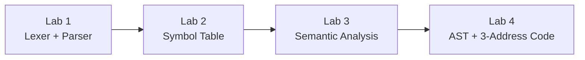

# Compiler Design

A from-scratch compiler front-end for a C subset, built incrementally across four labs — lexer, parser, symbol table, semantic analyzer, and finally an AST-driven three-address code generator. Every stage is hand-written with **Flex** and **Yacc/Bison**, in C++.

Watching a program go from raw source text to an actual intermediate representation, one compiler pass at a time, is genuinely one of the most satisfying things you can build as a CS student — this repo is that journey, kept intact stage by stage.

## Pipeline

Each lab is a working compiler on its own, and each one builds directly on the previous stage's grammar and machinery.



| Lab | Topic | What it adds |
|---|---|---|
| [`LAB_01`](LAB_01) | Lexical & Syntax Analysis | Tokenizes C source with Flex, recognizes grammar structure with a Yacc bottom-up parser |
| [`LAB_02`](LAB_02) | Symbol Table Generation | Scope-stacked hash tables — tracks every declared identifier, its type, and exactly which block it's visible in |
| [`LAB_03`](LAB_03) | Semantic Analysis | Type checking, uniqueness checking, array/function-call validation layered on top of the symbol table |
| [`LAB_04`](LAB_04) | Intermediate Code Generation | Builds an Abstract Syntax Tree while parsing, then walks it to emit three-address code (temporaries, labels, control-flow gotos) |

## Repository layout

Each lab folder is self-contained:

```text
LAB_0N/
  requirements/   -- the assignment spec as given, plus sample input/output
                     (requirements/sample_io/) used to verify correctness
  src/            -- the actual compiler: lexer, parser/grammar, and every
                     supporting header, ready to build and run as-is
```

## Tech stack

- **Flex** — lexical analyzer generator
- **Yacc / Bison** — LALR parser generator
- **C++** — every grammar action, symbol table, AST node, and code generator
- **g++ / MinGW** — build toolchain

## Building and running a lab

Each `src/` folder ships its own `script.sh` that does the whole thing — generates the parser and scanner, compiles them, links them, and runs the compiler against a sample input:

```bash
cd LAB_04/src
bash script.sh
```

That's it — no separate configure step, no external dependencies beyond `flex`, `yacc`/`bison`, and a C++ compiler on your `PATH`. Swap in your own `.c` test file and re-run to try it against different input.

Each lab's `requirements/sample_io/` folder holds the original sample programs and their expected output, if you want to verify a build against known-good results yourself.

## Contact

For questions or discussions about the implementations:

- Create an [issue](../../issues) in this repository

## Acknowledgments

**Institution:** BRAC University
**Course:** CSE420 — Compiler Design Lab
**Semester:** Summer 2026

## Academic Integrity

This repository is shared publicly for learning and reference purposes. While you're welcome to study the implementations and understand the concepts, please do not copy code directly for your coursework or assignments.

Academic integrity matters. Use this as a learning resource to build your own understanding, not as a shortcut. Your future self (and your professor) will thank you.

**Note:** The assignment specs under each lab's `requirements/` folder are BRAC University's own course material, included here for context alongside the implementations — not authored by this repository.

Happy Learning!

## License

This project is licensed under the [MIT License](LICENSE).
